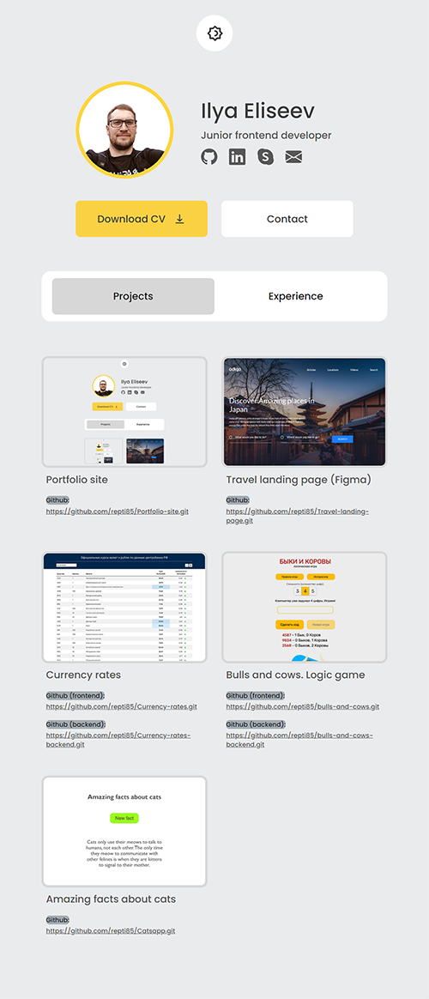
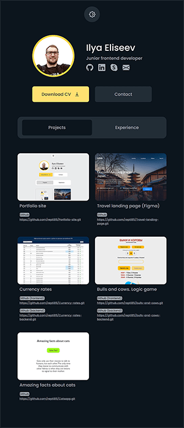

<h1 align="center">
<a href="https://repti58.github.io/Portfolio-site/">
Portfolio site
</a>
</h1>

https://repti58.github.io/Portfolio-site

## Contains:
- **Completed projects**
- **Stack and experience description**
- **CV**
- **Contacts**

## Features:
- **Figma adaptive layout**
- **Color theme change**
- **Technologies used: HTML, SASS/SCSS, JavaScript**

## Appearance:

## Performance:

